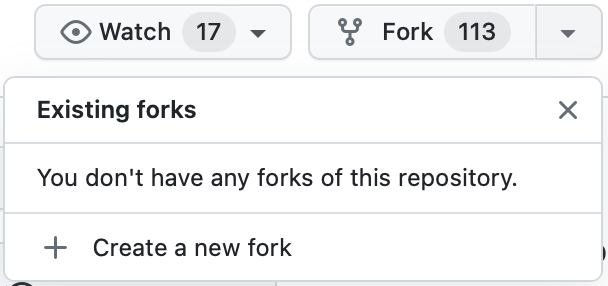
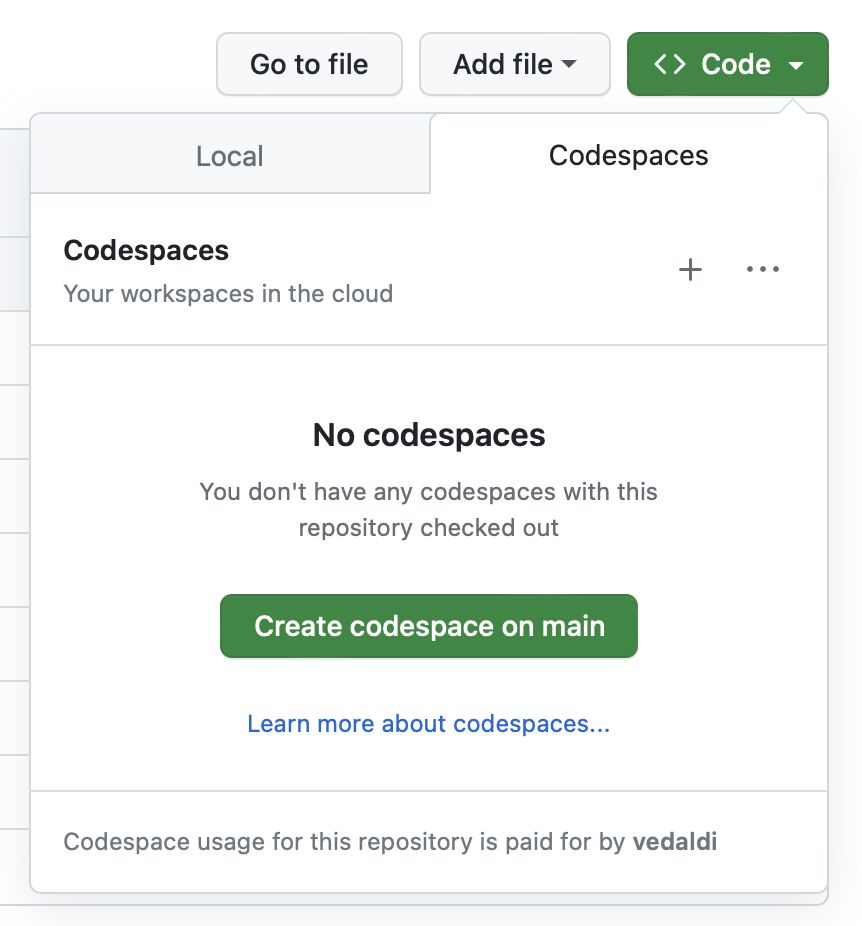
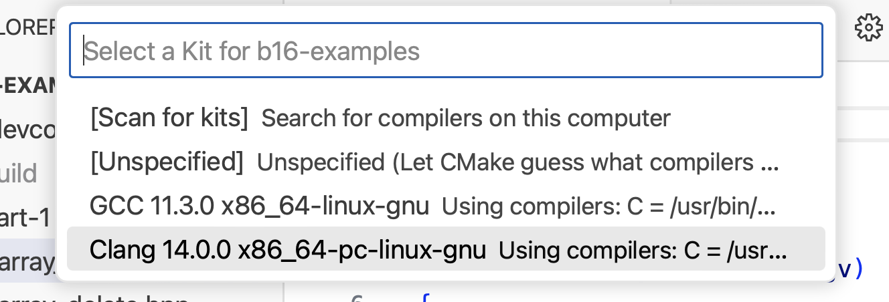
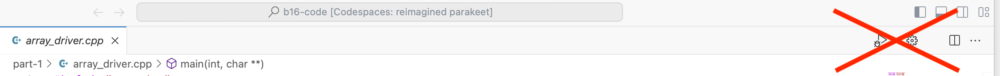
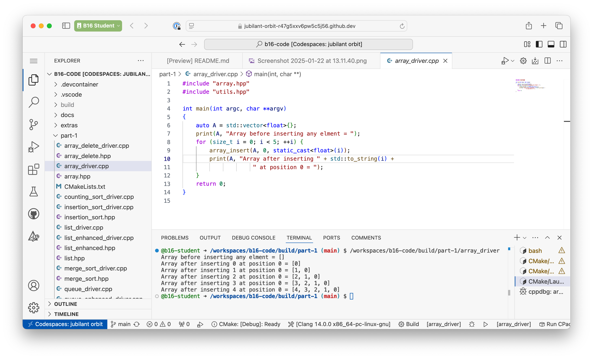
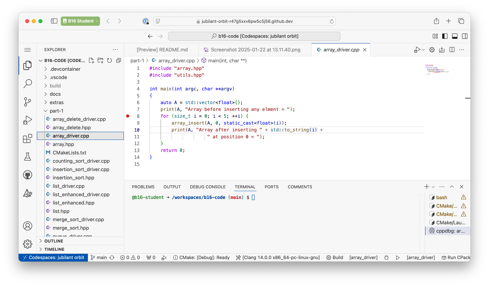
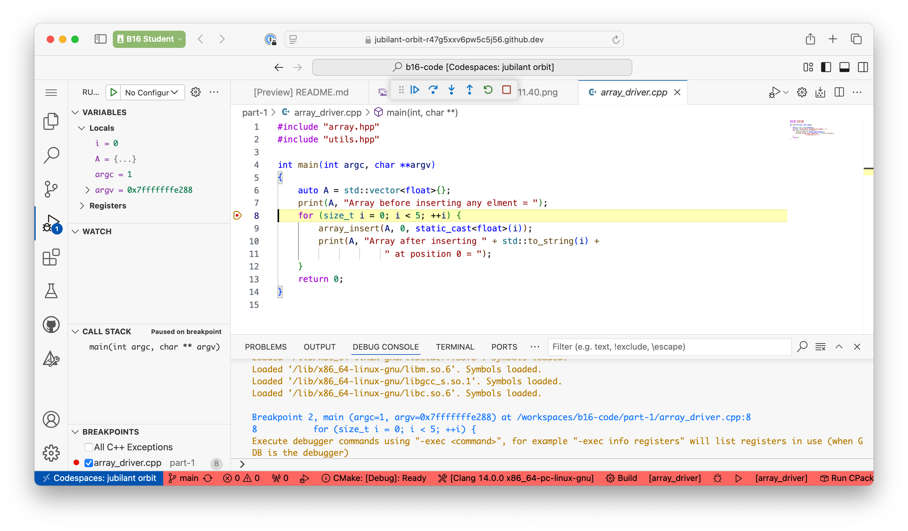
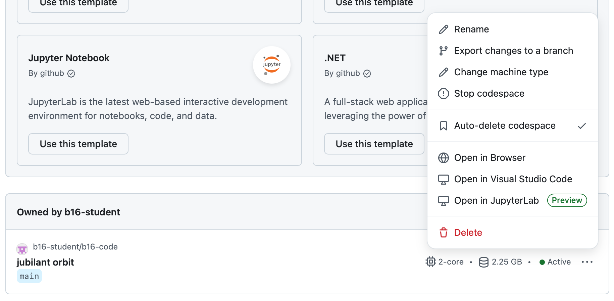
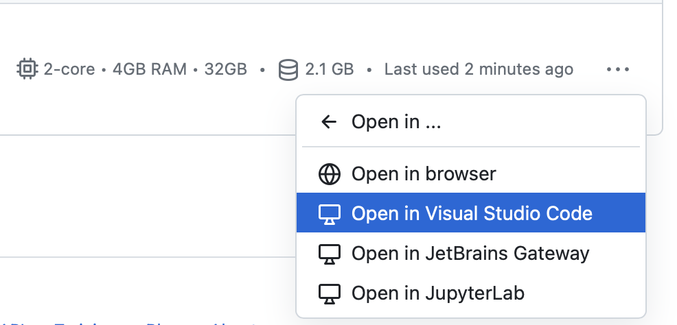

# B16 Algorithms

This is the source code for the _B16 Software Engineering - Part 3: Algorithms and Data Structure_ course at the Engineering Science Department at the University of Oxford. The code materials are available [here](https://www.robots.ox.ac.uk/~vedaldi/teach.html). This page explains how to setup the project code for development. You have two options:

1. Using a [codespace](#develop-using-github-codespaces) (recommended)
2. Using a [local copy](#develop-using-your-local-machine) of the code

## Develop using GitHub codespaces

The easiest way to compile the course code, as well as to do your programming exercises, is to use a [GitHub codespace](https://github.com/features/codespaces). A codespace gives you access to an online computer, already configured with a fully-featured C++ system and the project source code pre-installed and ready to compile.

To access a codespace, follow these steps:

1. You will need a GitHub account. If you do not have one, create it [here](https://github.com). After setting up your account, you can also optionally join GitHub education tier [here](https://education.github.com/pack/join). The latter gives you more hours per month to use codespaces.

2. Go to the course GitHub page at https://github.com/vedaldi/b16-code

3. Fork the repository using the "Fork" dropdown menu and selecting "Create a new fork":

   

   This will create your own copy of the project repository. Using a fork will allow you to push your changes (save your work) as you progress, as well as to use a codespace to work on your exercises online.

4. From the forked repository, click the green "Code" button. It will open a dropdown menu. In the dropdown menu, click the "Create codespace on main" button.

   

   This will open an editor in your web browser with the project source code. This is an instance of [Visual Studio Code](https://code.visualstudio.com) (VSCode), a fully featured editor great for programming (do not confuse it with Visual Studio, an entirely different Microsoft product!).

5. After a few seconds, VS Code will ask you to select a "Kit", i.e., a compiler to use for the project:

   

   We suggest to pick Clang as it results in better error reporting.

6. Compile and run one the examples:
   *  First, click on the name of the target to the right of the play icon (⏵) *and select a target like `array_driver`. This button can be found at the botton in the *status bar*.

      

      > **Remark.** If you fail to select a specific target, the tool will compile *all* available programs, including the ones from the example sheet. Because the programs from the example sheet are incomplete (on purpose), you will get several compilation errors:

   *  Then, click on the play icon (⏵):

      

      > **Remark.** Do *not* use the play button at the top-right. This does not use CMake to compile your program and will generally not have the correct compilation flags.
         

      This will open up a terminal window to show you the results:

      

7. Try to debug the example. Select `array_driver.cpp` in the file browser and click to the left of a line number to drop a breakpoint, denoted by a red bullet:

   

   Press the debug icon (it looks like a bug) next to the play icon.

   

   The debugger allows you to executed the program line-by-line while inspecting the value of the variables.

Once a codespace instance is started, it will keep running until you stop it, or automatically after 30 minutes (this timeout can be configured). Do not forget to stop your instance, as you only have 60 hours of codespace usage per month (90 if you enrol as a student).

To check which codespace instances are active and start and stop them, sue the [codespace manager](https://github.com/codespaces/).



Codespaces work very well with VS Code in the browser. If you have VS Code installed in your machine, you can also start the codespace and connect to it using your local VS Code copy, which makes the experience nearly indistinguishable from using a compiler in your local machine. For this, go to the codespace manager and select "Open in Visual Studio Code":



> **Important: Deleting a codespace.** Codespaces are automatically deleted if you do not use them for more than 30 days. When you delete a codespace, automatically or manually, the virtual machine is erased, deleting all the work you have done within it. The easiest way to **save your work** is to commit your changes and push them to your GitHub clone. You can do all this within VS Code, using its integrated Git support.

## Develop using your local machine

You can also compile and run the code on your local machine. For this, download a copy of the code from the GitHub course page. To do so, use the Code green button, then select "Local" and "Download ZIP". Even better, use command line [Git](https://git-scm.com) or the [GitHub app](https://desktop.github.com) to clone the repository to your local machine.

You will also require suitable software to compile the C++ code:

- We recommend using [VS Code](https://code.visualstudio.com) (available for Mac, Linux and Windows) to edit, compile and debug the project code. This gives you the same features as the web-based solution described above. Within VS Code, install the VS Code [C++ extension pack](https://marketplace.visualstudio.com/items?itemName=ms-vscode.cpptools-extension-pack), which adds C++ support.

- You will also need a C++ compiler. Depending on your machine, you can use:

  | Platform | Compiler                | Where to get it                                  |
  | -------- | ----------------------- | ------------------------------------------------ |
  | Mac      | Xcode                   | Download from the App Store                      |
  | Windows  | Visual Studio Community | https://visualstudio.microsoft.com/vs/community/ |
  | Linux    | GCC                     | Install using the package manager                |

  Note that Xcode and Visual Studio are fully-featured integrated development environments (IDE) in their own right. While they can compile and debug the project code just fine, we still recommend using VS Code for simplicity.

- You will need also [CMake](https://cmake.org), a tool for configuring software projects. You can obtain it from [here](https://cmake.org/download/).

### Building using Visual Studio (Windows)

Visual Studio has native support for cmake-based projects. Follow the instructions [here](https://learn.microsoft.com/en-us/cpp/build/cmake-projects-in-visual-studio).

### Building from the command line using cmake (Linux and Mac)

You can use the command line (the terminal) to compile the C++ programs provided.
For this, you can run `cmake` twice, the first time to configure the project, and the second time to compile the software, as follows:

```bash
cmake -B build -S . -DBUILD_EXERCISES=OFF
cmake --build build
```

The first command creates a subdirectory `build` which will contain the compiled programs (as well as various configuration files).
The second command then runs the compiler to compile _all_ programs in one go.

The `-DBUILD_EXERCISES=OFF` option disables building the exercises. These are given as incomplete (you have to write the code!), so they result in compilation errors if you attempt to compile them as they are.

You can also compile a specific target.

### Building using Xcode (Mac)

You can also use `cmake` to generate project files that you can open in Xcode (mac) and Visual Studio (windows):

```bash
cmake -G Xcode -B build -S .
```

This will create an Xcode project in the `build/` folder, which you can open with Xcode.
